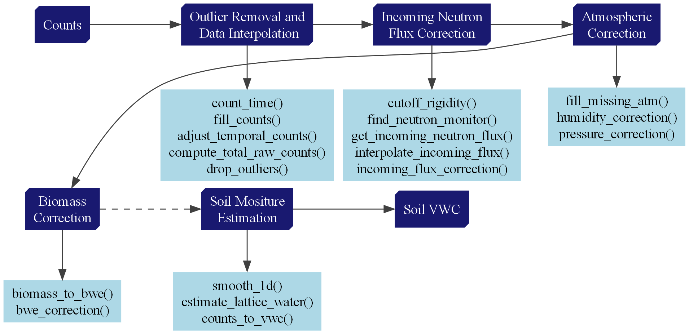
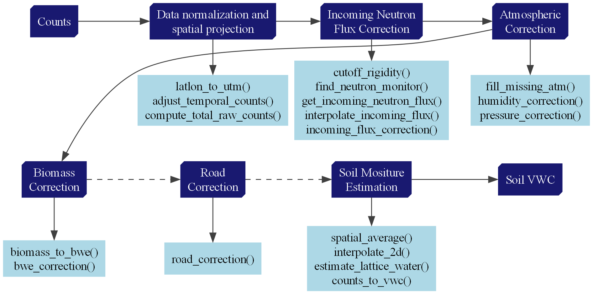

### Overview

The CRNPy library provides the tools to correct and process neutron counts recorded with both stationary and roving cosmic-ray neutron probes. Below are two flowcharts describing the typical steps from the correction of raw neutron counts to the conversion into volumetric soil water content.

#### Stationary CRNP processing

Dashed lines indicate optional steps. See the complete [example notebook](../examples/stationary/example_RDT_station/).

#### Roving CRNP processing

Dashed lines indicate optional steps. See the complete [example notebook](../examples/rover/Hydroinnova_rover_example/).

### Incoming neutron flux
The CRNPy library includes a complete set of methods for correcting the raw observed neutron counts for natural variation in the incoming neutron flux, including a set of tools for searching and downloading data from reference neutron monitors from the NMDB database (www.nmdb.eu) with similar the cut-off rigidity as the study location (Klein et al., 2009; Shea & Smart., 2019).

| Incoming neutron flux correction factor|
|---------------------------------|
|$fi = \frac{I_{m}}{I_{0}}$|
|$ fi $: Incoming neutron flux correction factor|
|$ I_{m} $: Measured incoming neutron flux|
|$ I_{0} $: Reference incoming neutron flux at a given time.|

!!! info "Implementation"

    See  [crnpy.crnpy.cutoff_rigidity][], [crnpy.crnpy.find_neutron_monitor][], [crnpy.crnpy.get_incoming_neutron_flux][], [crnpy.crnpy.interpolate_incoming_flux][] and [crnpy.crnpy.incoming_flux_correction][] documentation for the implementation details.

### Atmospheric corrections
The CRNPy library also provides functions for correcting raw neutron counts for atmospheric pressure, air humidity, and air temperature (Andreasen et al., 2017; Rosolem et al., 2013).

| Pressure correction | Atmospheric water correction |
|---------------------|------------------------------|
|$fp = exp(\frac{P_{0} - P}{L})$ | $fw = 1 + 0.0054*(A - Aref)$ |
|$fp$: Atmospheric pressure correction factor | $fw$: Atmospheric water correction factor
|$P_{0}$: Reference atmospheric pressure (for e.g. long-term average) | $A$: Atmospheric water content
|$P$: Measured atmospheric pressure | $Aref$: Reference atmospheric water content
|$L$: Mass attenuation factor for high-energy neutrons in air | |

!!! info "Implementation"

    See [crnpy.crnpy.humidity_correction][] and [crnpy.crnpy.pressure_correction][] documentation for the implementation details.

### Biomass correction
The library provides a function for correcting neutron counts for the effects of above-ground biomass by combining an approach for estimating biomass water equivalent (BWE) from in-situ biomass samples and the BWE correction factor (Baatz et al., 2015).

| Biomass correction |
|--------------------|
|$fb = 1 - bwe*r2_N0$ |
|$fb$: Biomass correction factor |
|$bwe$: Biomass water equivalent |
|$r2_N0$: Ratio of the neutron counts reduction ($counts kg^-1$) to the neutron calibration constant (N0) |

!!! info "Implementation"

    See [crnpy.crnpy.bwe_correction][] and [crnpy.crnpy.biomass_to_bwe][] documentation for the implementation details.

### Road correction
The lCRNPY library includes functions to correct for the effect of roads during rover surveys which account for the field soil water content and the road water content following the approach proposed by Schrön et al., (2018).

| Road correction |
|-----------------|
|$fr = 1 + F1 \cdot F2 \cdot F3$ |
|$fr$: Road correction factor |
|$F1$: Road geometry term |
|$F2$: Road moisture term |
|$F3$: Road distance term |

!!! info "Implementation"

    See [crnpy.crnpy.road_correction][] documentation for the implementation details.

### Additional corrections

Other correction routines includes corrections for soil lattice water and total soil carbon that are known to affect the attentuation of epithermal cosmic-ray neutrons. A function to estimate the soil lattice water content based on clay content and soil organic carbon content was developed using soil samples collected across the state of Kansas.

!!! info "Implementation"

    See [crnpy.crnpy.estimate_lattice_water][] and [crnpy.crnpy.counts_to_vwc][] documentation for the implementation details.

!!! note "References"

    Klein, K.-L., Steigies, C., & Nmdb Team. (2009). WWW.NMDB.EU: The real-time Neutron Monitor database. EGU General Assembly Conference Abstracts, 5633.
    
    Shea, M., & Smart, D. (2019). Re-examination of the first five ground-level events. International Cosmic Ray Conference (ICRC2019), 36, 1149.
    
    Smart, D., & Shea, M. (2001). Geomagnetic cutoff rigidity computer program: Theory, software description and example.
    
    Andreasen, M., Jensen, K. H., Desilets, D., Franz, T. E., Zreda, M., Bogena, H. R., & Looms, M. C. (2017). Status and perspectives on the cosmic-ray neutron method for soil moisture estimation and other environmental science applications. Vadose Zone Journal, 16(8), 1–11.
    
    Rosolem, R., Shuttleworth, W. J., Zreda, M., Franz, T. E., Zeng, X., & Kurc, S. A. (2013). The effect of atmospheric water vapor on neutron count in the cosmic-ray soil moisture observing system. Journal of Hydrometeorology, 14(5), 1659–1671.
    
    Zreda, M., Desilets, D., Ferré, T., & Scott, R. L. (2008). Measuring soil moisture content non-invasively at intermediate spatial scale using cosmic-ray neutrons. Geophysical Research Letters, 35(21).
    
    Dong, J., & Ochsner, T. E. (2018). Soil texture often exerts a stronger influence than precipitation on mesoscale soil moisture patterns. Water Resources Research, 54(3), 2199–2211.
    
    Wahbi, A., Heng, L., Dercon, G., Wahbi, A., & Avery, W. (2018). In situ destructive sampling. Cosmic Ray Neutron Sensing: Estimation of Agricultural Crop Biomass Water Equivalent, 5–9.
    
    Baatz, R., Bogena, H., Hendricks Franssen, H.-J., Huisman, J., Montzka, C., & Vereecken, H. (2015). An empirical vegetation correction for soil water content quantification using cosmic ray probes. Water Resources Research, 51(4), 2030–2046.
    
    Schrön, M., Rosolem, R., Köhli, M., Piussi, L., Schröter, I., Iwema, J., Kögler, S., Oswald, S. E., Wollschläger, U., Samaniego, L., & others. (2018). Cosmic-ray neutron rover surveys of field soil moisture and the influence of roads. Water Resources Research, 54(9), 6441–6459.
    
    Zreda, M., Shuttleworth, W. J., Zeng, X., Zweck, C., Desilets, D., Franz, T., and Rosolem, R.: COSMOS: the COsmic-ray Soil Moisture Observing System, Hydrol. Earth Syst. Sci., 16, 4079–4099, https://doi.org/10.5194/hess-16-4079-2012, 2012.
