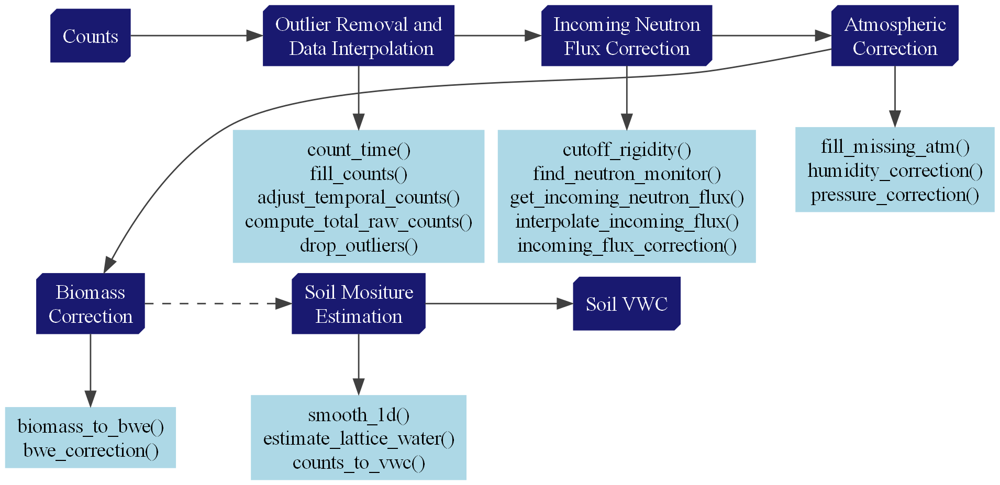
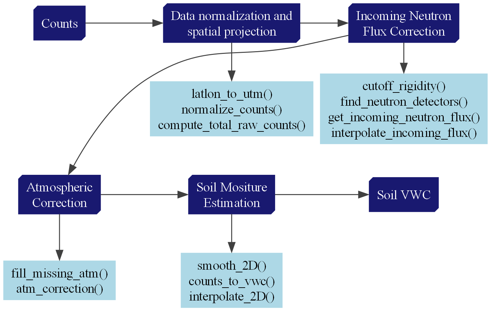

### Overview

The CRNPy library provides the tools to correct and process neutron counts recorded with both stationary and roving cosmic-ray neutron probes. Below are two flowcharts describing the typical steps from the correction of raw neutron counts to the conversion into volumetric soil water content.

#### Stationary CRNP processing

Dashed lines indicate optional steps. See the complete [example notebook](../examples/stationary/example_RDT_station/).

#### Roving CRNP processing

Dashed lines indicate optional steps. See the complete [example notebook](../examples/rover/Hydroinnova_rover_example/).

### Incoming neutron flux
The CRNPy library includes a complete set of methods for correcting the raw observed neutron counts for natural variation in the incoming neutron flux, including a set of tools for searching and downloading data from reference neutron monitors from the NMDB database (www.nmdb.eu) with a similar cut-off rigidity as the study location (Klein et al., 2009; Smart & Shea, 2008).

| Incoming neutron flux correction factor|
|---------------------------------|
|$fi = \frac{I_{m}}{I_{0}}$|
|$ fi $: Incoming neutron flux correction factor|
|$ I_{m} $: Measured incoming neutron flux|
|$ I_{0} $: Reference incoming neutron flux at a given time.|

Corrected counts are obtained as $N_{corr} = N \cdot fw / (fp \cdot fi)$. Differences in cut-off rigidity and atmospheric depth between the study site and the reference neutron monitor can optionally be accounted for following Hawdon et al. (2014) or McJannet and Desilets (2023).

!!! info "Implementation"

    See  [crnpy.crnpy.cutoff_rigidity][], [crnpy.crnpy.find_neutron_monitor][], [crnpy.crnpy.get_incoming_neutron_flux][], [crnpy.crnpy.interpolate_incoming_flux][], [crnpy.crnpy.correction_incoming_flux][], [crnpy.crnpy.atmospheric_depth][] and [crnpy.crnpy.location_factor][] documentation for the implementation details.

### Atmospheric corrections
The CRNPy library also provides functions for correcting raw neutron counts for atmospheric pressure, air humidity, and air temperature (Andreasen et al., 2017; Rosolem et al., 2013).

| Pressure correction | Atmospheric water correction |
|---------------------|------------------------------|
|$fp = exp(\frac{P_{0} - P}{L})$ | $fw = 1 + 0.0054*(A - Aref)$ |
|$fp$: Atmospheric pressure correction factor | $fw$: Atmospheric water correction factor
|$P_{0}$: Reference atmospheric pressure (for e.g. long-term average) | $A$: Atmospheric absolute humidity (g/m3)
|$P$: Measured atmospheric pressure | $Aref$: Reference atmospheric absolute humidity (g/m3)
|$L$: Mass attenuation factor for high-energy neutrons in air | |

!!! info "Implementation"

    See [crnpy.crnpy.correction_humidity][], [crnpy.crnpy.correction_pressure][] and [crnpy.crnpy.abs_humidity][] documentation for the implementation details.

### Biomass correction
The library provides a function for correcting neutron counts for the effects of above-ground biomass by combining an approach for estimating biomass water equivalent (BWE) from in-situ biomass samples and the BWE correction factor (Baatz et al., 2015).

| Biomass correction |
|--------------------|
|$N_{corr} = \frac{N}{1 - BWE \cdot r_2/N_0}$ |
|$N$, $N_{corr}$: Neutron counts before and after the biomass correction |
|$BWE$: Biomass water equivalent (kg m$^{-2}$) |
|$r_2/N_0$: Fractional reduction in neutron counts per kg m$^{-2}$ of BWE, about 0.5 % (0.0053) according to Baatz et al. (2015) |

!!! info "Implementation"

    See [crnpy.crnpy.correction_bwe][] and [crnpy.crnpy.biomass_to_bwe][] documentation for the implementation details.

### Road correction
The CRNPy library includes functions to correct for the effect of roads during rover surveys which account for the field soil water content and the road water content following the approach proposed by Schrön et al., (2018).

| Road correction |
|-----------------|
|$N_{corr} = N / C_{road}$ with $C_{road} = 1 + F1 \cdot F2 \cdot F3$ |
|$C_{road}$: Road correction factor |
|$F1$: Road geometry term (road width) |
|$F2$: Road moisture term (road and field water content) |
|$F3$: Road distance term (distance from the road center) |

!!! info "Implementation"

    See [crnpy.crnpy.correction_road][] documentation for the implementation details.

### Additional corrections

Other correction routines include corrections for soil lattice water and water bound in soil organic matter, which are known to affect the attenuation of epithermal cosmic-ray neutrons. Both quantities enter the calibration function as gravimetric water equivalents (g of water per g of dry soil). A function to estimate the gravimetric soil lattice water content based on clay content and soil organic carbon content was developed using soil samples collected across the state of Kansas.

!!! info "Implementation"

    See [crnpy.crnpy.lattice_water][] and [crnpy.crnpy.counts_to_vwc][] documentation for the implementation details.

### Footprint weighting for calibration

Soil samples collected for the calibration of a detector are averaged with the horizontal and vertical weighting functions of Schrön et al. (2017), which account for the distance of each sample from the detector, the depth of each sample, air humidity, air pressure and vegetation height. The weighting is iterated until the field-average soil moisture converges. The sensing depth of the detector can be estimated with the functions of Franz et al. (2012) or Schrön et al. (2017).

!!! info "Implementation"

    See [crnpy.crnpy.nrad_weight][] and [crnpy.crnpy.sensing_depth][] documentation for the implementation details.

!!! note "References"

    Klein, K.-L., Steigies, C., & Nmdb Team. (2009). WWW.NMDB.EU: The real-time Neutron Monitor database. EGU General Assembly Conference Abstracts, 5633.
    
    Smart, D., & Shea, M. (2001). Geomagnetic cutoff rigidity computer program: Theory, software description and example.

    Smart, D. F., & Shea, M. A. (2008). World grid of calculated cosmic ray vertical cutoff rigidities for epoch 1995.0. Proceedings of the 30th International Cosmic Ray Conference (Mérida), 1, 733-736.
    
    Andreasen, M., Jensen, K. H., Desilets, D., Franz, T. E., Zreda, M., Bogena, H. R., & Looms, M. C. (2017). Status and perspectives on the cosmic-ray neutron method for soil moisture estimation and other environmental science applications. Vadose Zone Journal, 16(8), 1–11.
    
    Rosolem, R., Shuttleworth, W. J., Zreda, M., Franz, T. E., Zeng, X., & Kurc, S. A. (2013). The effect of atmospheric water vapor on neutron count in the cosmic-ray soil moisture observing system. Journal of Hydrometeorology, 14(5), 1659–1671.
    
    Zreda, M., Desilets, D., Ferré, T., & Scott, R. L. (2008). Measuring soil moisture content non-invasively at intermediate spatial scale using cosmic-ray neutrons. Geophysical Research Letters, 35(21).
    
    Dong, J., & Ochsner, T. E. (2018). Soil texture often exerts a stronger influence than precipitation on mesoscale soil moisture patterns. Water Resources Research, 54(3), 2199–2211.
    
    Wahbi, A., Heng, L., Dercon, G., Wahbi, A., & Avery, W. (2018). In situ destructive sampling. Cosmic Ray Neutron Sensing: Estimation of Agricultural Crop Biomass Water Equivalent, 5–9.
    
    Baatz, R., Bogena, H., Hendricks Franssen, H.-J., Huisman, J., Montzka, C., & Vereecken, H. (2015). An empirical vegetation correction for soil water content quantification using cosmic ray probes. Water Resources Research, 51(4), 2030–2046.

    Franz, T. E., Zreda, M., Ferre, T. P. A., Rosolem, R., Zweck, C., Stillman, S., Zeng, X., & Shuttleworth, W. J. (2012). Measurement depth of the cosmic ray soil moisture probe affected by hydrogen from various sources. Water Resources Research, 48(8), W08515.

    Hawdon, A., McJannet, D., & Wallace, J. (2014). Calibration and correction procedures for cosmic-ray neutron soil moisture probes located across Australia. Water Resources Research, 50(6), 5029–5043.

    McJannet, D. L., & Desilets, D. (2023). Incoming neutron flux corrections for cosmic-ray soil and snow sensors using the global neutron monitor network. Water Resources Research, 59(4), e2022WR033889.

    Schrön, M., Köhli, M., Scheiffele, L., Iwema, J., Bogena, H. R., Lv, L., et al. (2017). Improving calibration and validation of cosmic-ray neutron sensors in the light of spatial sensitivity. Hydrology and Earth System Sciences, 21(10), 5009–5030.
    
    Schrön, M., Rosolem, R., Köhli, M., Piussi, L., Schröter, I., Iwema, J., Kögler, S., Oswald, S. E., Wollschläger, U., Samaniego, L., & others. (2018). Cosmic-ray neutron rover surveys of field soil moisture and the influence of roads. Water Resources Research, 54(9), 6441–6459.
    
    Zreda, M., Shuttleworth, W. J., Zeng, X., Zweck, C., Desilets, D., Franz, T., and Rosolem, R.: COSMOS: the COsmic-ray Soil Moisture Observing System, Hydrol. Earth Syst. Sci., 16, 4079–4099, https://doi.org/10.5194/hess-16-4079-2012, 2012.
