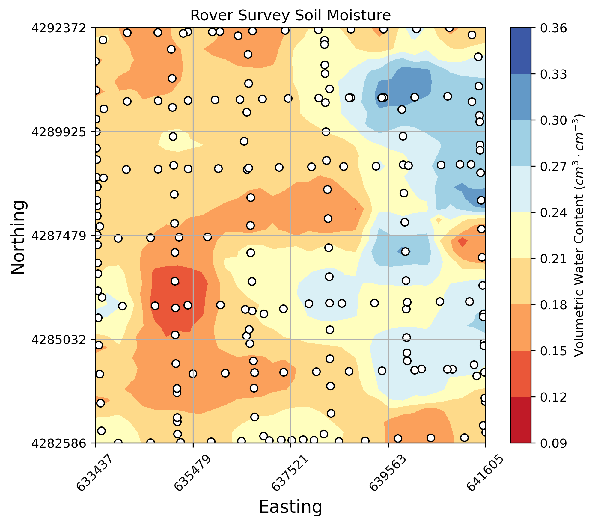

# Summary

CRNPy is a Python library that facilitates the processing, analysis, and conversion of raw cosmic-ray neutron counts obtained with stationary and roving cosmic-ray neutron probes (CRNP) into volumetric soil water content. The CRNPy library includes routines for atmospheric, biomass, and road corrections, along with one-dimensional and two-dimensional filtering. The library extends its utility by offering horizontal and vertical footprint determination, uncertainty estimation, depth extrapolation operators, and routines to assist users with field calibration. The design of the CRNPy library prioritizes reproducibility, ease of use, and compatibility across instruments, facilitating its adoption by manufacturers, end users, and researchers working to integrate non-invasive soil moisture sensing in agricultural and hydrological applications. 

# Statement of Need

Cosmic ray neutron probes (CRNP) are non-invasive soil moisture sensors that fill the niche between point-level and satellite sensors. However, the conversion of raw CRNP data into soil moisture requires multiple corrections and filtering steps that are described across various peer-reviewed articles. To circumvent this limitation and enhance reproducibility, the CRNPy library offers a simple, instrument-agnostic, and integrated solution with minimal dependencies. Compared to the existing `crspy`[@power2021cosmic] library, CRNPy avoids stringent data naming conventions and external data requirements. A flexible data naming convention enables a seamless integration with output files from different instrument manufacturers and the non-requirement of external data sources makes the library more compact (only ~65 KB)  and straight forward to install. Compared to the `corny` [@cornish_pasdy] toolbox's GUI-based workflow, CRNPy's modular design based on Python functions promotes integration and reproducibility within data analysis pipelines and interactive development environments like Jupyter Lab notebooks. In addition, its straightforward installation using the Python Package Index, the minimal dependencies—most included with the Anaconda open-source ecosystem—and the comprehensive datasets with included examples in the form of Jupyter notebooks, provide an accessible start for CRNP data processing. The CRNPy library emphasizes easy maintenance and community-driven improvements since users can expand its capabilities by adding regular Python functions to the core module. The compact size and simple structure of the CRNPy library can also enable future integration into cloud-based services, IoT sensors, and system-on-chip technologies, broadening its use and customization potential.

# Library features

The CRNPy library integrates standard routines for processing CRNP data, with features including:

- Utilization of core scientific Python libraries like Numpy [@harris2020array], Pandas [@mckinney2011pandas], SciPy [@virtanen2020scipy], and Matplotlib [@hunter2007matplotlib], that are readily available within the Anaconda environment. All CRNPy functions are compatible with Numpy arrays or Pandas series for robust data science functionality.
- Utility functions for obtaining site-specific lattice water, geomagnetic cutoff rigidity [@smart2001geomagnetic], and neutron monitor references [@2009NMDB], which are required for pre-processing raw neutron counts.
- Flexible input data handling from delimited text files without stringent naming conventions for columns, which keeps scripts simpler, increases reproducibility, and minimizes human error. This aspect also enables a more versatile, modular, and customizable workflow (\autoref{fig:workflow_stationary} and \autoref{fig:workflow_rover}) that adapts to instrument outputs from different manufacturers.
- Detection of possible outliers using range detection based on user-provided lower and upper boundaries, interquartile range, z-scores, and a scaled mean absolute difference  [@iglewicz1993volume].
- Corrections for atmospheric pressure as described by @zreda2012cosmos, air humidity [@rosolem2013], and incoming neutron flux following the guidelines from @zreda2012cosmos; @hawdon2014calibration; @mcjannet2023incoming. The article by @andreasen2017status provides an overall description of these correction methods included in CRNPy (\autoref{fig:output_stationary}a and \autoref{fig:output_stationary}b).
- Corrections to account for additional hydrogen pools in above- and below-ground plant biomass [@baatz2015empirical; @wahbi2018situ].
- Corrections to account for the impact of road soil moisture conditions during roving surveys [@schron2018cosmic].
- Conversion of corrected counts into volumetric soil water content following the approach suggested by @desilets2010nature.
- Determination of neutron count uncertainty following the method detailed in @jakobi2020error (see \autoref{fig:output_stationary}c). 
- Estimation of sensing depth by determining the volume that accounts for 86% of the origin of the counted neutrons [@franz2012measurement; @schron2017improving].
- An exponential filter operator [@albergel2008near] to extend near-surface soil moisture conditions to the rootzone [@rossini2021predicting; @franz2020practical], see \autoref{fig:output_stationary}d.
- Utility functions for spatial filtering and basic interpolation routines required to process CRNP rover surveys (see \autoref{fig:output_rover})

# Acknowledgements

This project was supported by Agriculture and Food Research Initiative Competitive Grant no. 2019-68012-29888 from the USDA National Institute of Food and Agriculture. The authors declare no competing interests.

# References

